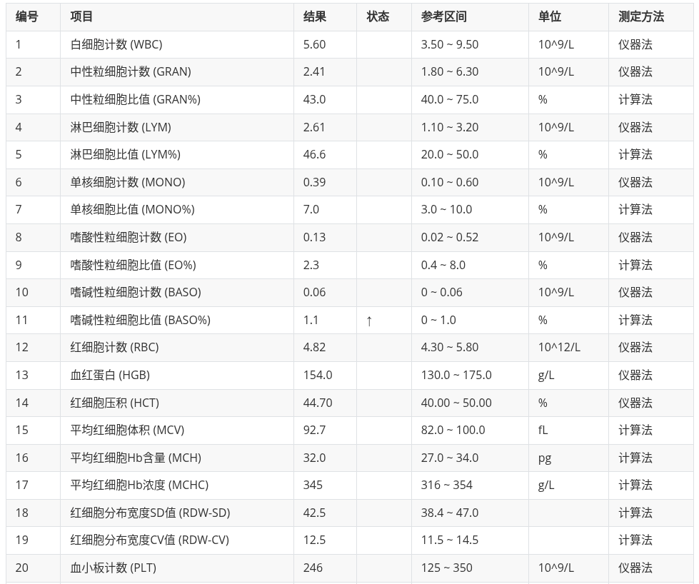

# MediParse: 基于 Gemini API 的医学化验单批量识别与结构化工具

## 📖 简介 (Abstract)
**MediParse** 旨在解决传统 OCR 工具对复杂排版医学化验单（Medical Lab Reports）识别率低、缺乏语义理解的问题。通过 Python 脚本批量调用 Google Gemini 1.5 Flash 多模态大模型，实现从 **医学化验单图片** 到 **标准化结构化数据 (CSV)** 的自动化转换。

本工具专为临床科研设计，能够处理歪斜、模糊、污渍及复杂表格线的化验单，并自动提取关键指标，极大地提高了数据录入的效率与准确性。

## 🔍 背景 (Context)
* **痛点 (Problem):** 临床回顾性研究中常积累大量纸质或图片格式的化验单。手动录入耗时耗力且易出错；传统 OCR（如 Tesseract）难以应对非结构化布局，且无法识别医学单位或纠正语义错误。
* **解决方案 (Solution):** 利用 Gemini 1.5 Flash 强大的长上下文和视觉理解能力，直接读取图片并提取 Key-Value 数据，输出为标准化的 CSV 格式，便于直接导入 R (ggplot2) 或 Python (pandas) 进行下游统计分析与可视化。

## ✨ 主要功能 (Features)
* **批量处理:** 自动遍历文件夹下的所有图片文件 (.jpg, .png, .jpeg)。
* **结构化输出:** 直接生成包含 `Source_File`, `项目名称`, `结果`, `参考区间`, `单位`, `异常标记` 的 CSV 表格。
* **语义理解:** 能够识别并标准化医学术语，自动处理空值。
* **高鲁棒性:** 对图片拍摄角度、光照及折痕有较强的抗干扰能力。

## 🛠️ 快速开始 (Getting Started)

### 1. 环境准备 (Prerequisites)
* Python 3.8+
* Google Gemini API Key (需要 [申请 API Key](https://aistudio.google.com/app/apikey))

### 2. 安装依赖 (Installation)
```bash
git clone https://github.com/zetian-jia/MediParse.git
cd MediParse
pip install -r requirements.txt
```

### 3. 配置 (Configuration)
打开 `main.py` 文件，找到配置区域，填入你的 API Key：

```python
# =配置区域=====
API_KEY = "YOUR_GEMINI_API_KEY_HERE"  # <--- 替换为你的实际 Key
IMAGE_FOLDER = "./lab_images"
```

### 4. 准备数据 (Prepare Data)
将你的医学化验单图片放入 `lab_images` 文件夹中。
* **示例图片说明:**
    * 图片应清晰可见，包含化验单的主要表格区域。
    * 支持手机拍摄照片或扫描件。
    * 尽量保证文字方向正确（虽然模型有一定纠正能力）。
    * *注：本项目未提供真实患者数据，请使用自行脱敏的化验单进行测试。*


### 5. 运行 (Usage)
```bash
python main.py
```
程序运行后，将在根目录生成 `batch_results.csv` 文件。

## 📊 输出结果说明 (Output)
生成的 `batch_results.csv` 包含以下列：





## ⚠️ 注意事项
* **隐私安全:** 请确保上传的图片不包含患者姓名、身份证号等敏感隐私信息（PII）。建议在处理前对图片头部敏感区域进行裁剪或打码。
* **API 成本:** Gemini 1.5 Flash 目前有免费层级，但请关注配额限制 (Rate Limits)。脚本中已内置简单的延时保护。

## License
MIT License
